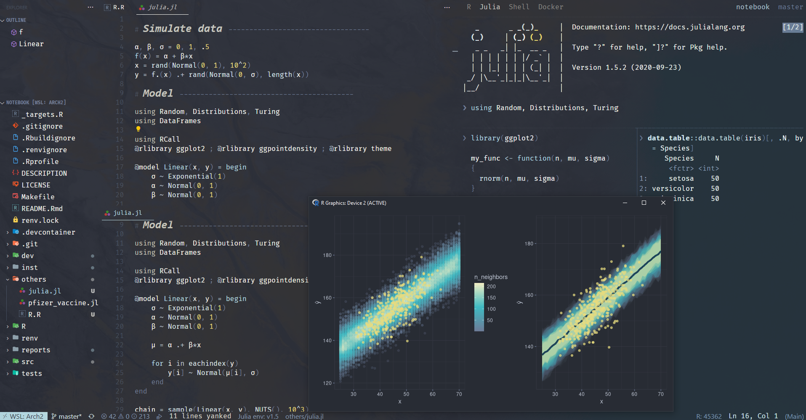
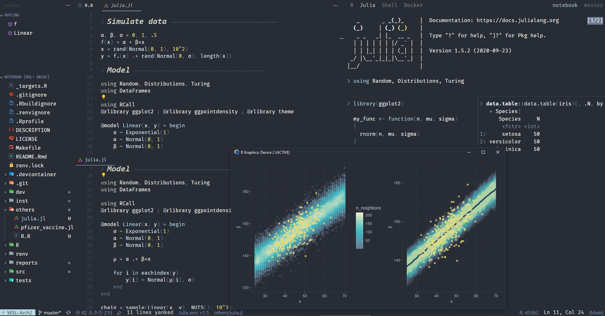

# README

_NOTE Draft only...many TODOs. Haven't updated for a super long time._

Personal theme package as part of [minimalist](https://github.com/kar9222/minimalist). See there for details.

TODO
- Add light theme
- Publish to VSCode extension store

# Gallery





# Install

Not yet published. Temporary solution

```bash
git clone git@github.com:kar9222/minimalist-vscode.git && cd minimalist-vscode

# Install npm if not done

npm install -g vsce
# Package
vsce package

# Install local VSIX
code --install-extension minimalist-vscode-0.0.1.vsix
```
