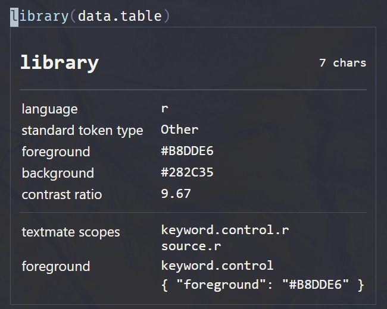

# README

_NOTE Draft only...many TODOs. Haven't updated for a super long time._

Personal theme package as part of [minimalist](https://github.com/kar9222/minimalist). See there for details.

TODO
- Add new dark-greenish theme
- Add light theme
- Publish to VSCode extension store

# Gallery


# Install

Not yet published. Temporary solution

```bash
git clone git@github.com:kar9222/minimalist-vscode.git && cd minimalist-vscode

# Install npm if not done

npm install -g vsce
# Package
vsce package

# Install local VSIX
code --install-extension minimalist-vscode-0.0.1.vsix
```


# Customization

In your settings.json, refer to [minimalist.json](https://github.com/kar9222/minimalist-vscode/blob/master/themes/minimalist.json)
- For `"colors"` field in minimalist.json, associate it with `workbench.colorCustomizations` in settings.json
- For `"tokenColors"` field in minimalist.json, associate it with `editor.tokenColorCustomizations` in settings.json

To see what 'token' or 'scope' to colorize,
1. `command pallete`
2. Call `Developer: Inspect Editor Tokens and Scopes`
3. Put your cursor at the character/words/symbols/etc you want the scope



<br>

4. Based on the 'token' or 'scope', modify theme at settings.json

```json
{
    "workbench.colorCustomizations": {
        // Customize terminal colors
        "terminal.background":          "#282C35",
        "terminal.foreground":          "#f8f8f2",
        "terminal.selectionBackground": "#444958",

        // Customize Git decorations
        "gitDecoration.modifiedResourceForeground":  "#DCE5EC",
        "gitDecoration.deletedResourceForeground":   "#B8DDE6",
        "gitDecoration.untrackedResourceForeground": "#f8f8f2",

        // ...
    },
    "editor.tokenColorCustomizations": {
        // Customize comments
        {
            "scope": [
                "comment",
                "comment keyword",
                "comment markup.underline.link",
                "comment string",
                "comment .definition",
                "comment punctuation",
                "comment text"
            ],
            "settings": {
                "name": "Comments and overrides inside comments",
                "fontStyle": "",
                "foreground": "#6E7C96"
            }
        },
        // Customize keyword operators
        {
            "scope": [
                "keyword.operator",
                "keyword.operator.member",
                "keyword.operator.new"
            ],
            "settings": {
                "name": "Operator",
                "foreground": "#909BAF"
            }
        },
        // ...
    },
}
```
